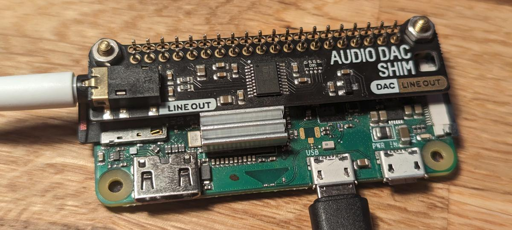

# DACspot Buildroot customization

This README explains the steps I need to take to build a customized **Buildroot** image for a **Raspberry Pi Zero W** with a [**HiFiBerry DAC**](https://shop.pimoroni.com/products/audio-dac-shim-line-out) backpack, based on `raspberrypi0w_defconfig` to suit my needs with WiFi and a SquashFS rootfs etc.



### 1. Download Buildroot

[Get a recent Buildroot release](https://buildroot.org/downloads/manual/manual.html#getting-buildroot) and extract it somewhere (or clone the git repository). At the time of this writing, the latest LTS release was `buildroot-2023.02.2`.

```sh
curl --remote-name-all https://buildroot.org/downloads/buildroot-2023.02.2.tar.xz{,.sign}
gpg --verify buildroot-2023.02.2.tar.xz.sign
sed -n 's/^SHA256: //p' *.sign | sha256sum -c
tar xf buildroot-2023.02.2.tar.xz
cd buildroot-2023.02.2/
```

### 2. Apply default configuration

This directory is [a `BR2_EXTERNAL` overlay](https://buildroot.org/downloads/manual/manual.html#outside-br-custom), which can be used to include customized default configurations and extra packages. Specify the path to this overlay and apply the `dacspot_defconfig` config to use it. (*You don't need to specify `BR2_EXTERNAL` on subsequent commands because its value is stored in a hidden file.*)

```sh
make BR2_EXTERNAL=../ dacspot_defconfig
```

This defconfig uses an additional Linux kernel configuration fragment in `configs/linux_fragment`; it is needed to enable in-kernel SquashFS support for booting the readonly partition.

Tracking the configuration in an external package like this *should* make release upgrades easier. At least the jump from `2023.02` to `2023.02.2` was completely painless.

#### 2.1 Additional secrets

If you track some *additional* values – e.g. the `wpa_supplicant.conf` secrets – in a file in this overlay, you can apply those with a little helper script.

```sh
support/kconfig/merge_config.sh .config \
  "$(sed -nE 's/^BR2_EXTERNAL_DACSPOT_PATH="(.+)"$/\1/p' .config)/secrets.cfg"
```

### 3. Configure

Want to add something? Now's the time. If you didn't populate all necessary secrets in 2.1 you'll need to set them manually under `External options ---> ...`.

```sh
make menuconfig
```

Most of the options in this overlay should have a useful help message. But there's two credentials that you **need** to populate after applying the defaults:

* The WiFi assumes a simple WPA2-secured network and requires you to specify the SSID `DACSPOT_USE_WIRELESS_SSID` and preshared key `DACSPOT_USE_WIRELESS_PSK`.
* Librespot needs a Spotify login to work correctly, so populate your username `BR2_PACKAGE_LIBRESPOT_CONF_USERNAME` and password `BR2_PACKAGE_LIBRESPOT_CONF_PASSWORD`.

If you made other significant changes, run `make savedefconfig` and try to merge the new options in the existing `dacspot_defconfig` for later.

### 4. Build the image

When you're happy with the configuration, run the build which generates `output/images/sdcard.img`. This will take a while.

```sh
make
```

The built image can be directly written to a micro SD card for your Pi.

The post-scripts and genimage config in `board/` have been copied and modified from the in-tree files at `board/raspberrypi/`. You might want to check if they're still up-to-date with assumptions made by Buildroot at the time.

Small temporary additions can be made in `output/target/` before rerunning `make`. Be aware that the post-scripts may overwrite your changes though.

### TODO

* Bluetooth receiver support
* Maybe add [Snapcast](https://github.com/badaix/snapos)

### Sources

* [The Buildroot Manual](https://buildroot.org/downloads/manual/manual.html)
* [Note on using `support/kconfig/merge_config.sh`](https://stackoverflow.com/a/72864457)
* [Buildroot Zero W wireless](https://unix.stackexchange.com/a/448501)
* [Sirsipe's Buildroot externals with `rpi-wifi`](https://github.com/sirsipe/buildroot-externals#package-raspberrypi-wifi-rpi-wifi)
* [SnapOS Guide for a Pi Zero W](https://du.nkel.dev/blog/2021-04-10_buildroot-snapos/)
* [RPiconfig reference (`config.txt` options)](https://elinux.org/RPiconfig#Boot)
* [Adjust partitions in `genimage.cfg`](https://stackoverflow.com/questions/60164914/multiple-partitions-in-buildroot)
* [Kernel config fragments](https://stackoverflow.com/a/43915427)
* ... and possibly quite a few more that I forgot to note
